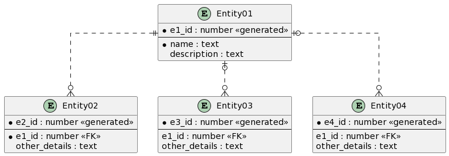

# UML
Series về học UML/ Demo các lược đồ thực tế<br/>
Mỗi nhánh trong Repo sẽ là 1 ví dụ/ giải pháp/ project mẫu trong UML

# Tools sử dụng
- DrawIO online trên https://app.diagrams.net/
- PlantUML online trên https://plantuml.com/
- PlantUML được cài đặt ở Local & tích hợp vào Visual Studio Code/ Intellij IDEA

# Folder liên quan trên Windows
```
D:\Projects\UML
```

==============================================================

# Ví dụ [06.ERDiagram]
==============================================================

(Tìm hiểu về Entity Relationship Diagram)

## Tham khảo
- https://viblo.asia/p/mo-hinh-quan-he-thuc-the-entity-relationship-model-oOVlYEenl8W
- https://viblo.asia/p/hieu-va-phan-biet-3-loai-erd-notation-thuong-gap-6J3ZgpPBlmB
- https://viblo.asia/p/tao-er-diagram-cua-mot-database-bang-mysql-workbench-OeVKBqvy5kW
- https://youtu.be/KmqOajhoqAg?si=ggB8DA6wjOwKmXmw
- https://cole.edu.vn/entity-relationship-diagram-erd/
- https://plantuml.com/ie-diagram

## Một số ví dụ Entity Relationship Diagram xây dựng trên PlantUML
```shell
@startuml
' hide the spot
' hide circle

' avoid problems with angled crows feet
skinparam linetype ortho

entity "Entity01" as e01 {
  *e1_id : number <<generated>>
  --
  *name : text
  description : text
}

entity "Entity02" as e02 {
  *e2_id : number <<generated>>
  --
  *e1_id : number <<FK>>
  other_details : text
}

entity "Entity03" as e03 {
  *e3_id : number <<generated>>
  --
  e1_id : number <<FK>>
  other_details : text
}

entity "Entity04" as e04 {
  *e4_id : number <<generated>>
  --
  e1_id : number <<FK>>
  other_details : text
}

e01 ||..o{ e02
e01 |o..o{ e03
e01 |o..o{ e04
@enduml
```


