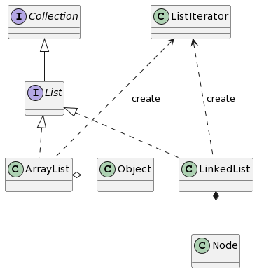
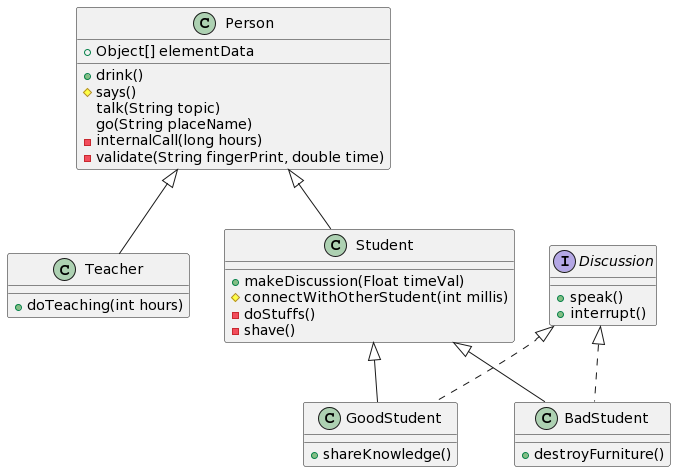

# UML
Series về học UML/ Demo các lược đồ thực tế<br/>
Mỗi nhánh trong Repo sẽ là 1 ví dụ/ giải pháp/ project mẫu trong UML

# Tools sử dụng
- DrawIO online trên https://app.diagrams.net/
- PlantUML online trên https://plantuml.com/
- PlantUML được cài đặt ở Local & tích hợp vào Visual Studio Code/ Intellij IDEA

# Folder liên quan trên Windows
```
D:\Projects\UML
```

==============================================================

# Ví dụ [04.ClassDiagram]
==============================================================

(Tìm hiều về Class Diagram)

## Tham khảo
- https://viblo.asia/p/tim-hieu-ve-cach-thiet-ke-class-diagram-L4x5xLyY5BM
- https://iviettech.vn/blog/813-classs-diagarm-ban-ve-ve-classlop.html
- https://codegym.vn/blog/2022/02/17/cach-doc-uml-class-diagram/
- https://www.mindonmap.com/vi/blog/what-is-uml-class-diagram/
- https://codelearn.io/sharing/huong-dan-ve-bieu-do-lop-trong-uml
- https://codegym.cc/vi/groups/posts/vi.157.so-o-lop-uml
- https://plantuml.com/class-diagram

## Ví dụ Class Diagram về Collection Framework (rút gọn)
```shell
@startuml
class ArrayList {
}
class LinkedList {
}
interface List
List <|.. ArrayList
List <|.. LinkedList

interface Collection
Collection <|-- List


class Object{
}
ArrayList o- Object

class Node{
}
LinkedList *-- Node

class ListIterator
ListIterator <... ArrayList : create
ListIterator <... LinkedList : create
@enduml

```



## Ví dụ Class Diagram về University (rút gọn)
```shell
@startuml
class Person {
    +Object[] elementData
    +drink()
    #says()
    talk(String topic)
    go(String placeName)
    -internalCall(long hours)
    -validate(String fingerPrint, double time)
}

class Teacher {
    +doTeaching(int hours)
}
class Student {
    +makeDiscussion(Float timeVal)
    #connectWithOtherStudent(int millis)
    -doStuffs()
    -shave()
}
Person <|-- Teacher
Person <|-- Student

interface Discussion {
    +speak()
    +interrupt()
}


class GoodStudent implements Discussion{
    +shareKnowledge()
}
class BadStudent implements Discussion{
    +destroyFurniture()
}
Student <|-- GoodStudent
Student <|-- BadStudent

@enduml
```

