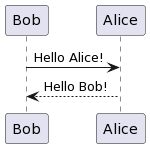
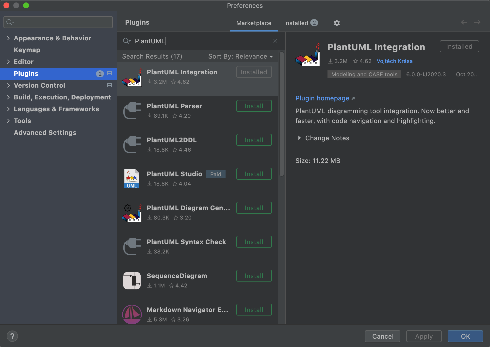
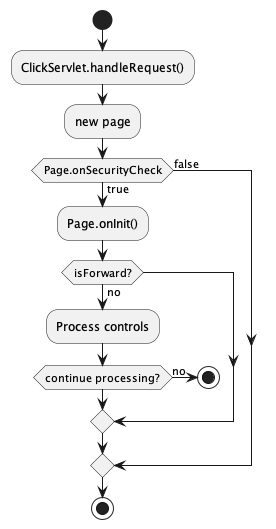
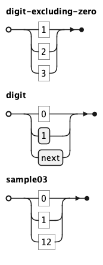
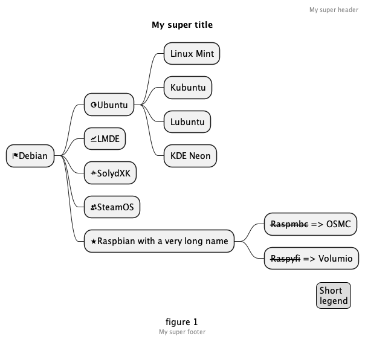
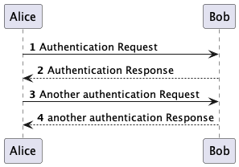
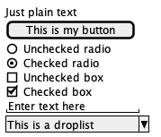
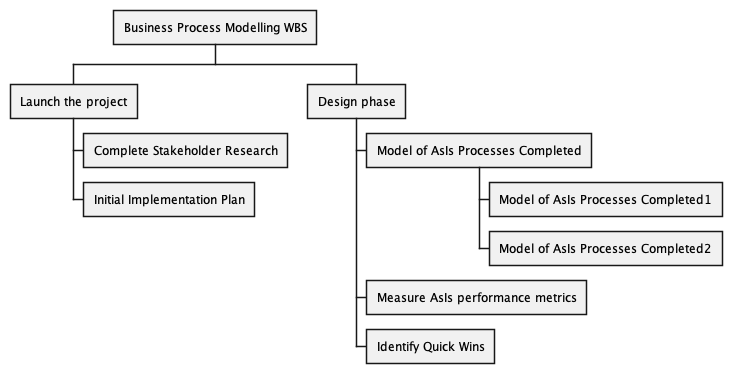
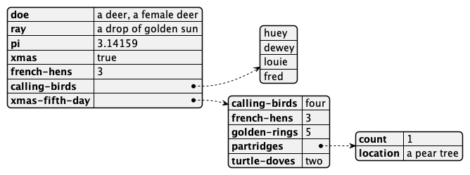

# UML
Series về học UML/ Demo các lược đồ thực tế<br/>
Mỗi nhánh trong Repo sẽ là 1 ví dụ/ giải pháp/ project mẫu trong UML

# Tools sử dụng
- DrawIO online trên https://app.diagrams.net/
- PlantUML online trên https://plantuml.com/
- PlantUML được cài đặt ở Local & tích hợp vào Visual Studio Code/ Intellij IDEA

# Folder liên quan trên Windows
```
D:\Projects\UML
```

==============================================================

# Ví dụ [02.PlantUML]
==============================================================

(Tìm hiểu về cách sử dụng PlantUML, xây dựng UML diagram thông qua coding theo cấu trúc của PlantUML)

## Tham khảo
- https://viblo.asia/p/plantuml-tool-ve-uml-bang-code-de-dang-nhanh-chong-say-goodbye-diagramnets-aWj53ok156m
- https://viblo.asia/p/plantuml-cong-cu-ve-ban-thiet-ke-phan-mem-tu-ma-gDVK2za0KLj
- https://www.jetbrains.com/help/idea/managing-plugins.html <br/>
(Cài đặt PlantUML plugin trong Intellij IDEA)

## Sử dụng PlantUML Online 
- Truy cập trang: http://www.plantuml.com/
- Mã nguồn mẫu UML 
```shell
@startuml
Bob -> Alice: Hello Alice!
Bob <-- Alice: Hello Bob!
@enduml
```


## Tích hợp PlantUML vào trong Intellij IDEA
- Cài đặt Plugin [PlantUML]: Preferences > Plugins


## Một số UML Diagram mẫu khi gọi New > PlantUML File 
- Activity Diagram
```shell
@startuml
'https://plantuml.com/activity-diagram-beta

start
:ClickServlet.handleRequest();
:new page;
if (Page.onSecurityCheck) then (true)
  :Page.onInit();
  if (isForward?) then (no)
    :Process controls;
    if (continue processing?) then (no)
      stop
    endif
  endif
else (false)
endif

stop

@enduml
```


- EBNF Diagram
```shell
@startebnf
digit-excluding-zero = "1" | "2" | "3" ;
digit                = "0" | 1 | next;
sample03= "0" | "1" | "12";
@endyaml
```


- MindMap Diagram
```shell
@startmindmap
'https://plantuml.com/mindmap-diagram

caption figure 1
title My super title

* <&flag>Debian
** <&globe>Ubuntu
*** Linux Mint
*** Kubuntu
*** Lubuntu
*** KDE Neon
** <&graph>LMDE
** <&pulse>SolydXK
** <&people>SteamOS
** <&star>Raspbian with a very long name
*** <s>Raspmbc</s> => OSMC
*** <s>Raspyfi</s> => Volumio

header
My super header
endheader

center footer My super footer

legend right
  Short
  legend
endlegend
@endmindmap
```


- Sequence Diagram
```shell
@startuml
'https://plantuml.com/sequence-diagram

autonumber

Alice -> Bob: Authentication Request
Bob --> Alice: Authentication Response

Alice -> Bob: Another authentication Request
Alice <-- Bob: another authentication Response
@enduml
```




- Wifreframe Diagram
```shell
@startuml
'https://plantuml.com/salt

salt
{
  Just plain text
  [This is my button]
  ()  Unchecked radio
  (X) Checked radio
  []  Unchecked box
  [X] Checked box
  "Enter text here   "
  ^This is a droplist^
}


@enduml
```



- WorkBreakDownStructure Diagram
```shell
@startwbs
'https://plantuml.com/wbs-diagram

* Business Process Modelling WBS
** Launch the project
*** Complete Stakeholder Research
*** Initial Implementation Plan
** Design phase
*** Model of AsIs Processes Completed
**** Model of AsIs Processes Completed1
**** Model of AsIs Processes Completed2
*** Measure AsIs performance metrics
*** Identify Quick Wins

@endwbs
```



- YAMLData Diagram
```shell
@startyaml
doe: "a deer, a female deer"
ray: "a drop of golden sun"
pi: 3.14159
xmas: true
french-hens: 3
calling-birds: 
	- huey
	- dewey
	- louie
	- fred
xmas-fifth-day: 
	calling-birds: four
	french-hens: 3
	golden-rings: 5
	partridges: 
		count: 1
		location: "a pear tree"
	turtle-doves: two
@endyaml
```


