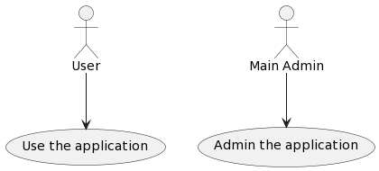
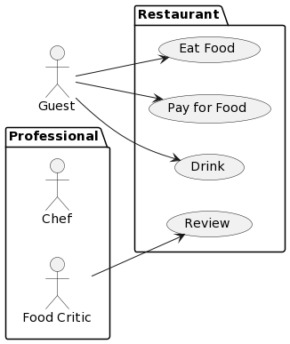
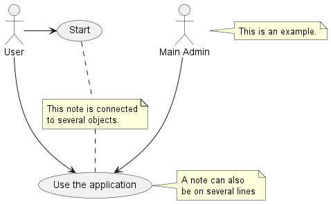
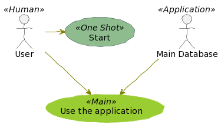
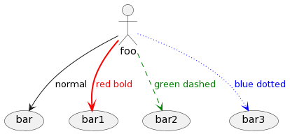

# UML
Series về học UML/ Demo các lược đồ thực tế<br/>
Mỗi nhánh trong Repo sẽ là 1 ví dụ/ giải pháp/ project mẫu trong UML

# Tools sử dụng
- DrawIO online trên https://app.diagrams.net/
- PlantUML online trên https://plantuml.com/
- PlantUML được cài đặt ở Local & tích hợp vào Visual Studio Code/ Intellij IDEA

# Folder liên quan trên Windows
```
D:\Projects\UML
```

==============================================================

# Ví dụ [07.UseCaseDiagram]
==============================================================

(Tìm hiểu về Use Case Diagram)

## Tham khảo
- https://viblo.asia/p/cac-mau-so-do-use-case-va-lam-sao-de-tao-ra-chung-EvbLbbbQLnk
- https://viblo.asia/p/use-case-diagram-va-ly-do-su-dung-trong-kiem-thu-phan-mem-p1-obA46PBXLKv
- https://viblo.asia/p/use-case-diagram-va-ly-do-su-dung-trong-kiem-thu-phan-mem-p2-Ny0VG9vzJPA

## Một số ví dụ Use Case Diagram xây dựng trên PlantUML
- UseCase Diagram 01
```shell
@startuml
:User: --> (Use)
"Main Admin" as Admin
"Use the application" as (Use)
Admin --> (Admin the application)
@enduml
```



- UseCase Diagram 02
```shell
@startuml
left to right direction
actor Guest as g
package Professional {
  actor Chef as c
  actor "Food Critic" as fc
}
package Restaurant {
  usecase "Eat Food" as UC1
  usecase "Pay for Food" as UC2
  usecase "Drink" as UC3
  usecase "Review" as UC4
}
fc --> UC4
g --> UC1
g --> UC2
g --> UC3
@enduml
```



- UseCase Diagram 03
```shell
@startuml
@startuml
:Main Admin: as Admin
(Use the application) as (Use)

User -> (Start)
User --> (Use)

Admin ---> (Use)

note right of Admin : This is an example.

note right of (Use)
  A note can also
  be on several lines
end note

note "This note is connected\nto several objects." as N2
(Start) .. N2
N2 .. (Use)
@enduml

```



- UseCase Diagram 04
```shell
@startuml
skinparam handwritten true

skinparam usecase {
BackgroundColor DarkSeaGreen
BorderColor DarkSlateGray

BackgroundColor<< Main >> YellowGreen
BorderColor<< Main >> YellowGreen

ArrowColor Olive
ActorBorderColor black
ActorFontName Courier

ActorBackgroundColor<< Human >> Gold
}

User << Human >>
:Main Database: as MySql << Application >>
(Start) << One Shot >>
(Use the application) as (Use) << Main >>

User -> (Start)
User --> (Use)

MySql --> (Use)
@enduml
```



- UseCase Diagram 05
```shell
@startuml
actor foo
foo --> (bar) : normal
foo --> (bar1) #line:red;line.bold;text:red  : red bold
foo --> (bar2) #green;line.dashed;text:green : green dashed 
foo --> (bar3) #blue;line.dotted;text:blue   : blue dotted
@enduml
```
