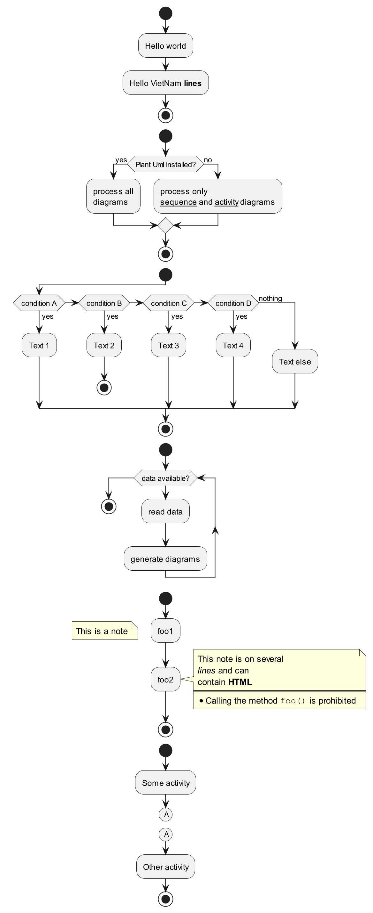
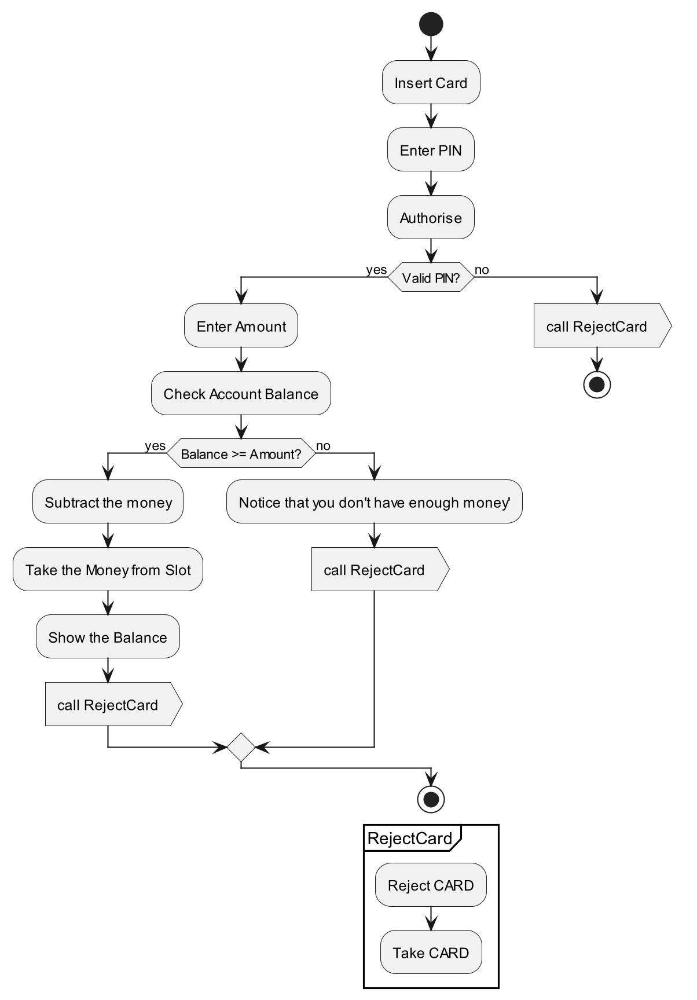

# UML
Series về học UML/ Demo các lược đồ thực tế<br/>
Mỗi nhánh trong Repo sẽ là 1 ví dụ/ giải pháp/ project mẫu trong UML

# Tools sử dụng
- DrawIO online trên https://app.diagrams.net/
- PlantUML online trên https://plantuml.com/
- PlantUML được cài đặt ở Local & tích hợp vào Visual Studio Code/ Intellij IDEA

# Folder liên quan trên Windows
```
D:\Projects\UML
```

==============================================================

# Ví dụ [05.ActivityDiagram]
==============================================================

(Tìm hiểu về Activity Diagram)

## Tham khảo
- https://www.bacs.vn/vi/blog/kien-thuc/gioi-thieu-ve-activity-diagram-20879.html
- https://youtu.be/QRar3e5Hiow?si=dH_vRFHfBdmOri72
- https://monhoc.weebly.com/uploads/1/6/9/3/16936172/lab04.pdf
- https://viblo.asia/p/activity-diagram-using-plant-uml-924lJAeNZPM
- https://iviettech.vn/blog/1066-activity-diagram-ban-ve-hoat-dong.html

## Ví dụ về 1 số mẫu trong Activity Diagram, hiện thực hóa bằng PlantUML
```shell
@startuml
skinparam dpi 200

' Hello World sample
start
:Hello world;
:Hello VietNam **lines**;
stop


' The if..else condition
start
if (Plant Uml installed?) then (yes)
  :process all\ndiagrams;
else (no)
  :process only
  __sequence__ and __activity__ diagrams;
endif
stop

' Another if..elseif
start
if (condition A) then (yes)
  :Text 1;
elseif (condition B) then (yes)
  :Text 2;
  stop
elseif (condition C) then (yes)
  :Text 3;
elseif (condition D) then (yes)
  :Text 4;
else (nothing)
  :Text else;
endif
stop

' The while loop
start
while (data available?)
  :read data;
  :generate diagrams;
endwhile
stop

' Using nodes
start
:foo1;
floating note left: This is a note
:foo2;
note right
  This note is on several
  //lines// and can
  contain <b>HTML</b>
  ====
  * Calling the method ""foo()"" is prohibited
end note
stop

' Using Connector
start
:Some activity;
(A)
detach
(A)
:Other activity;
stop

@enduml
```



## Ví dụ Activity Diagram về rút tiền ở cây ATM (rút gọn) 
```shell
@startuml
skinparam dpi 200

start
:Insert Card;
:Enter PIN;
:Authorise;
if (Valid PIN?) then (yes)
  :Enter Amount;
  :Check Account Balance;
  if (Balance >= Amount?) then (yes)
    :Subtract the money;
    :Take the Money from Slot;
    :Show the Balance;
    :call RejectCard>

  else (no)
    :Notice that you don't have enough money';
    :call RejectCard>
  endif
else (no)
  :call RejectCard>
  stop
endif

stop

partition RejectCard {
  :Reject CARD;
  :Take CARD;
}

@enduml
```


